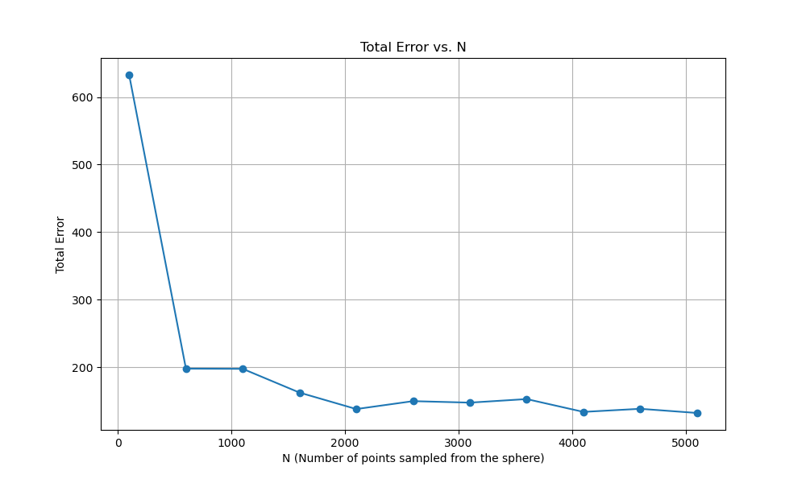

#  Spherical structured feature maps for kernel approximation. In International Conference on Machine Learning (2017 Lyu)

This repository contains a detailed review, summary, and implementation of the Random Fourier Features (RFF) method as introduced by Yueming Lyu in his 2017 paper published in The Proceedings of Machine Learning Research. The original paper is available [here](http://proceedings.mlr.press/v70/lyu17a/lyu17a.pdf).

> Lyu, Y. (2017, July). Spherical structured feature maps for kernel approximation. In International Conference on Machine Learning (pp. 2256-2264). PMLR.

## Implementation and Code

The Jupyter notebook `SFF.ipynb` includes a Python implementation of the SSF algorithm along with a demonstration of how it approximates the Gaussian kernel. It also contains visualizations of the actual vs. approximate kernels and an analysis of the convergence of the total and worst-case errors.

You can view and run the notebook directly in Google Colab:
- 📔 [SSF](https://colab.research.google.com/github/rfarell/2017_Lyu_SphericalStructuredFeatures/blob/main/SSF.ipynb)

## Visualizations

The repository includes the following visualizations generated from the code:

- `ssf_kernel.png`: Actual vs. Approximate Gaussian Kernel
- `ssf_error.png`: Total Error vs. D (Number of Random Features)
- `ssf_worst_case_error.png`: Worst-Case Error vs. D (Number of Random Features)

